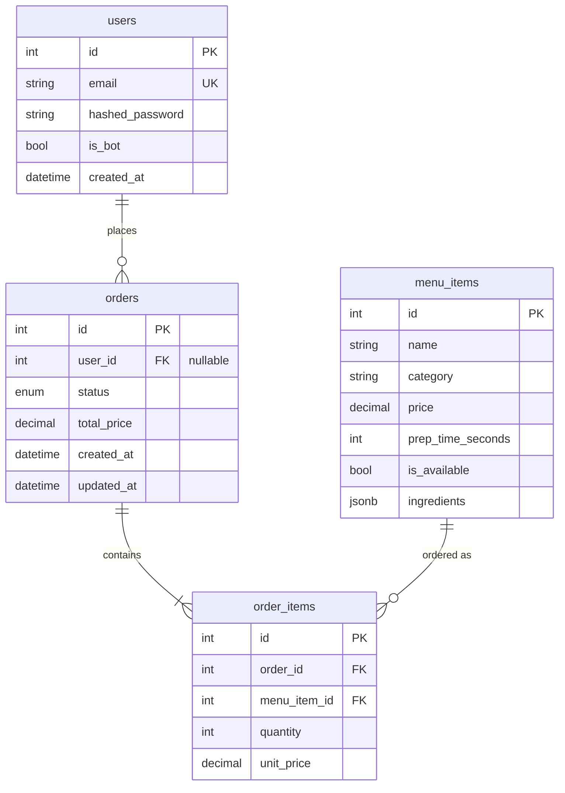

# Data Model Architecture

This document describes the SQLAlchemy ORM models, their relationships, and design decisions for the Sushi Queue order management system.

---

## Entity Relationship Diagram

> **Mermaid diagrams** render on GitHub and in editors with Mermaid support (e.g. VS Code "Markdown Preview Mermaid Support"). Below is an ASCII version that works everywhere.

### ASCII Diagram (always visible)

```
┌─────────────────────┐
│       users         │
├─────────────────────┤
│ id (PK)             │
│ email (UNIQUE)      │
│ hashed_password     │
│ is_bot              │
│ created_at          │
└──────────┬──────────┘
          │ 1
          │ places
          │ N
          ▼
┌─────────────────────┐         ┌─────────────────────┐
│       orders        │         │     menu_items      │
├─────────────────────┤         ├─────────────────────┤
│ id (PK)             │         │ id (PK)             │
│ user_id (FK, null)  │         │ name                │
│ status (enum)       │         │ category            │
│ total_price         │         │ price               │
│ created_at          │         │ prep_time_seconds   │
│ updated_at          │         │ is_available         │
└──────────┬──────────┘         │ ingredients (JSONB)  │
          │ 1                  └──────────┬──────────┘
          │ contains                       │
          │ N                              │ 1
          ▼                               │ ordered as
┌─────────────────────┐                   │ N
│    order_items      │◄──────────────────┘
├─────────────────────┤
│ id (PK)             │
│ order_id (FK)       │
│ menu_item_id (FK)   │
│ quantity            │
│ unit_price          │
└─────────────────────┘
```

### Mermaid (GitHub / Mermaid-enabled viewers)



---

## Relationship Overview

```
  User ──────1:N──────► Order ──────1:N──────► OrderItem
                                                      ▲
  MenuItem ───────────────────────1:N─────────────────┘
```

---

## Order Status State Machine

```
  [*] ──► PENDING ──► PREPARING ──► READY ──► DELIVERED
                │           │
                │           └── Stale timeout ──► CANCELLED
                └── Worker picks up
```

| Status | Meaning |
|--------|---------|
| `PENDING` | Order created, awaiting Celery worker |
| `PREPARING` | Worker processing (simulated kitchen prep) |
| `READY` | Ready for pickup |
| `DELIVERED` | Completed |
| `CANCELLED` | Stale (Beat > 10 min) or manual cancel |

---

## Models

### User

**Table:** `users`

| Column | Type | Constraints | Purpose |
|--------|------|-------------|---------|
| `id` | PK, serial | — | Surrogate key |
| `email` | VARCHAR(255) | UNIQUE, INDEX | Login identifier |
| `hashed_password` | VARCHAR(255) | — | bcrypt hash |
| `is_bot` | BOOLEAN | DEFAULT false | Simulator vs real user |
| `created_at` | TIMESTAMP | server_default | Audit |

**Relationships:**
- `orders` → `list[Order]` — One user can have many orders.

**Design notes:**
- `user_id` on `Order` is nullable to support bot/guest orders.
- `is_bot` distinguishes load-simulator orders from real user orders.

---

### MenuItem

**Table:** `menu_items`

| Column | Type | Constraints | Purpose |
|--------|------|-------------|---------|
| `id` | PK, serial | — | Surrogate key |
| `name` | VARCHAR(255) | INDEX | Searchable |
| `category` | VARCHAR(100) | — | Nigiri, Rolls, Sashimi, etc. |
| `price` | NUMERIC(10,2) | — | Current price |
| `prep_time_seconds` | INTEGER | — | Used by Celery worker |
| `is_available` | BOOLEAN | DEFAULT true | Soft delete |
| `ingredients` | JSONB | nullable | `{"rice": 50, "salmon": 40}` |

**Relationships:**
- `order_items` → `list[OrderItem]` — All order lines referencing this item.

**Design notes:**
- `ingredients` is JSONB for flexible schema and PostgreSQL aggregation queries. Used for summary reports (ingredients used).

---

### Order

**Table:** `orders`

| Column | Type | Constraints | Purpose |
|--------|------|-------------|---------|
| `id` | PK, serial | — | Surrogate key |
| `user_id` | FK → users.id | nullable | Placer (null for bots) |
| `status` | ENUM | INDEX, default PENDING | State machine |
| `total_price` | NUMERIC(10,2) | — | Sum of line items |
| `created_at` | TIMESTAMP | server_default | Audit |
| `updated_at` | TIMESTAMP | server_default, onupdate | Audit |

**Relationships:**
- `user` → `User | None` — Placer (nullable for guest/bot).
- `items` → `list[OrderItem]` — Line items.

**Design notes:**
- `updated_at` with `onupdate=func.now()` for audit trail.
- `status` indexed for queries like `WHERE status = 'PREPARING'`.

---

### OrderItem

**Table:** `order_items`

| Column | Type | Constraints | Purpose |
|--------|------|-------------|---------|
| `id` | PK, serial | — | Surrogate key |
| `order_id` | FK → orders.id | NOT NULL | Parent order |
| `menu_item_id` | FK → menu_items.id | NOT NULL | Which menu item |
| `quantity` | INTEGER | — | How many |
| `unit_price` | NUMERIC(10,2) | — | Price at order time |

**Relationships:**
- `order` → `Order` — Parent order.
- `menu_item` → `MenuItem` — Menu item.

**Design notes:**
- `unit_price` is a snapshot of `menu_items.price` at order time. Menu prices can change; historical orders keep their original price.
- `order_id` is required; every line belongs to an order.

---

## Foreign Key Summary

| From | To | Nullable | Purpose |
|------|-----|----------|---------|
| `orders.user_id` | `users.id` | Yes | Guest/bot orders |
| `order_items.order_id` | `orders.id` | No | Line belongs to order |
| `order_items.menu_item_id` | `menu_items.id` | No | Line references menu item |

---

## Query Patterns

### Get user's orders

```python
result = await db.execute(
    select(Order).where(Order.user_id == user_id).order_by(Order.created_at.desc())
)
orders = result.scalars().all()
```

### Get order with items and menu names

```python
result = await db.execute(
    select(Order)
    .options(selectinload(Order.items).selectinload(OrderItem.menu_item))
    .where(Order.id == order_id)
)
order = result.scalar_one_or_none()
# order.items[0].menu_item.name
```

### Aggregate ingredients used (summary report)

```python
# OrderItem × MenuItem.ingredients, sum per ingredient
for o in orders:
    for oi in o.items:
        mi = oi.menu_item
        if mi.ingredients:
            for ing, amt in mi.ingredients.items():
                ingredients_used[ing] += amt * oi.quantity
```

---

## Base Class

All models inherit from `app.core.database.Base` (DeclarativeBase). Alembic uses `Base.metadata` for autogenerate.

---

## Migration Notes

- `OrderStatus` enum is stored as PostgreSQL `ENUM` type.
- `ingredients` uses JSONB.
- Tables are created in dependency order: users → menu_items → orders → order_items.
